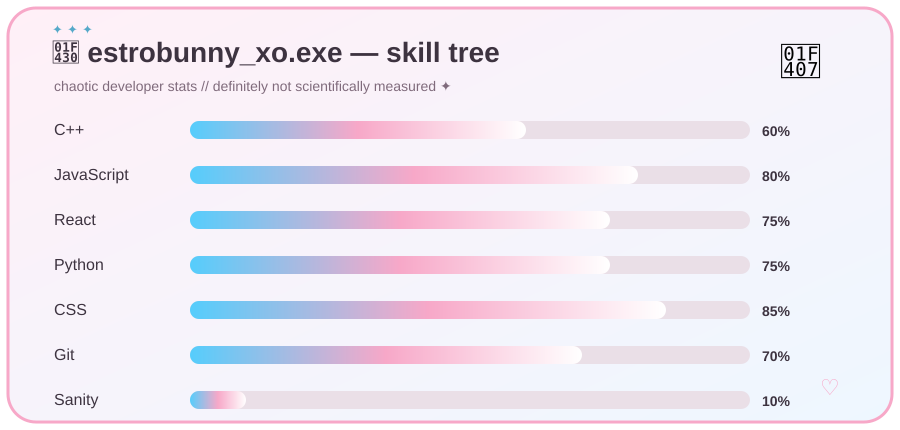

# 🐇💗 EstroBunny_xo 💙

<p align="center">
  
</p>

<p align="center">
  <b>🏳️‍⚧️ trans girl • 💻 developer • 🐇 professional menace • 💗 chaos enthusiast</b>
</p>

<p align="center">
  <i>"Silly girls change the world."</i>
</p>

---

## 🐰 WHO THE FUCK IS ESTROBUNNY?

```text
ʚ────────────────────────────────────────────ɞ
                                            
   🐇 Name       ┃EstroBunny_xo             
   💗 Alignment  ┃Chaotic Cute              
   🏳️‍⚧️ Status     ┃Still Here™              
   💻 Class      ┃Developer                 
   🧠 Brain      ┃37 tabs + 2 braincells    
   ☕ Fuel       ┃questionable decisions    
                                            
ʚ────────────────────────────────────────────ɞ
```

Hi. I'm **EstroBunny_xo** — a trans girl who likes making software, experimenting with stupid ideas, and occasionally turning a perfectly functional project into something significantly more complicated.

I like building things that **shouldn't exist but absolutely should**.

Most of my projects are somewhere between:

> *"This is actually a really good idea."*

and

> *"Why the fuck did I spend 14 hours implementing this?"*

---

## 💻 WHAT I DO

```text
╭─ CURRENTLY CAUSING PROBLEMS ─────────────────────╮

  🔨 Building things
  🧪 Experimenting with questionable ideas
  🎨 Making interfaces unnecessarily pretty
  🤖 Bullying AI into writing code
  🐛 Introducing bugs for future me to discover
  📖 Learning things the hard way
  🏳️‍⚧️ Existing loudly
  🐇 Being extremely normal about bunnies

╰───────────────────────────────────────────────────╯
```

### 🧠 Things I Like

* Full-stack development
* Open-source software
* UI/UX
* Developer tooling
* Game-related projects
* Automation
* AI-assisted development
* Making things unnecessarily configurable
* Breaking things until I understand them
* Turning random ideas into actual projects

---

## 🛠️ MY TOOLBOX

<p align="center">


</p>

### 💗 Currently flirting with


<p align="center">

</p>


---

## 🧪 PROJECT PHILOSOPHY

I don't really believe in building things just because they're practical.

Sometimes the best reason to make something is:

**"I wonder if I can."**

So I experiment.

I prototype.

I break things.

I rebuild them.

And eventually something cool comes out the other side.

---

## 📂 THINGS YOU'LL FIND AROUND HERE

```text
.
├── 💻 software
├── 🎨 pretty interfaces
├── 🧪 experiments
├── 🤖 AI-assisted nonsense
├── 🎮 gaming-related projects
├── 🛠️ developer tools
├── 📦 open-source stuff
└── 🐇 unexplained bunny-related incidents
```

Some repositories are polished.

Some are experiments.

Some are held together by duct tape, caffeine and spite.

**Please check the README before judging me.**

---

## 🏳️‍⚧️ TRANS GIRL DEVELOPER ARC

```text
          ✨
       ✨     ✨
    ✨    🐇    ✨
       ╲     ╱
        ╲___╱

     STILL HERE.
     STILL BUILDING.
     STILL CHAOTIC.
```

Being trans isn't something I want to hide behind a professional-looking developer persona.

It's part of me.

So yes, you're going to see pink.

You're going to see blue.

You're probably going to see a bunny.

And there's a very good chance something is going to be slightly unhinged.

---

## 📊 GITHUB ACTIVITY

<p align="center">
  
</p>

<p align="center">
  
</p>

---

## 🐇 RANDOM BUNNY WISDOM

> **Good girls cause problems.**

> **Cute doesn't mean harmless.**

> **If it works, don't touch it.**

> **If it doesn't work, blame the compiler.**

> **If the compiler agrees with you, become suspicious.**

---

## 💌 FIND ME

<p align="center">

<a href="https://github.com/Estro-Bunny">
  
</a>

</p>

---

<p align="center">
  <b>🏳️‍⚧️ TRANS • 🐇 CHAOS • 💗 CUTE • 💻 CODE</b>
</p>

<p align="center">
  <i>Still here. Still building. Still causing problems. ♡</i>
</p>

<p align="center">
  
</p>
